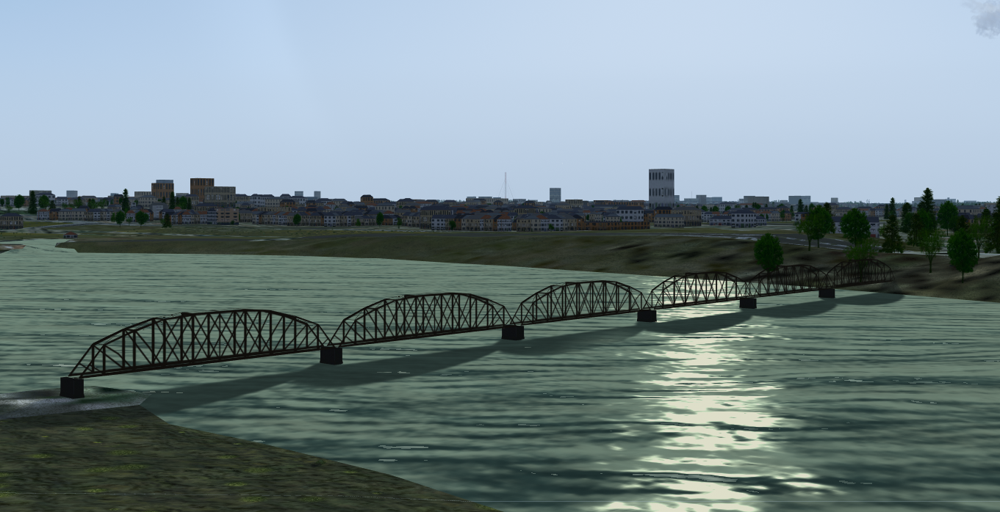

Blender model of a 48m truss bridge
===================================
This is a Public Domain, low-polygon model of a generic 48 m (150 ft) steel truss bridge span, optimised for use in the [FlightGear](https://flightgear.org) flight simulator.  You can join multiple spans end-to-end, as in the screenshot.

## UnLicense

This model is released into the Public Domain. See UNLICENSE.md for details.

## Author

Started by David Megginson, October 2024.  Attribution is appreciated, but not required.
